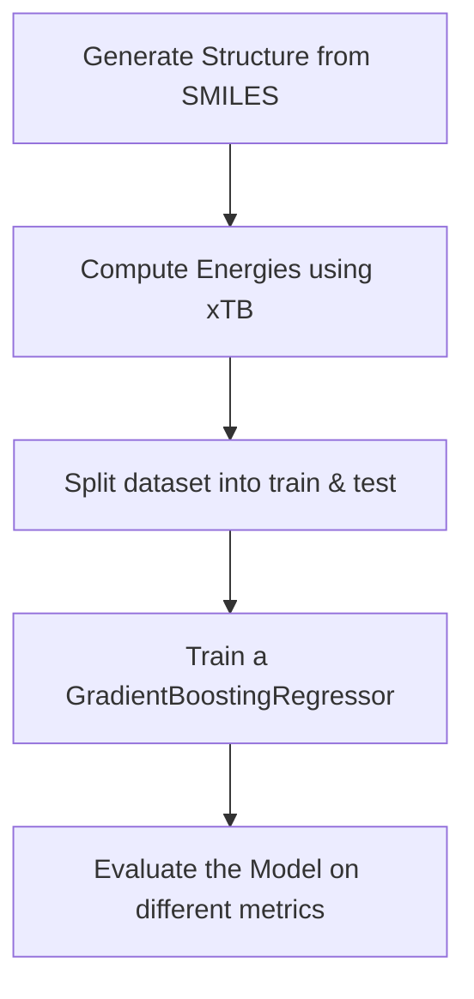

# Train a Gradient Boosting Regressor on Conformations of EtOH

This Tutorial will provide the code for the following workflow:

You need to have the `pip install -r requirements.txt` installed.
Additionally, we will use `xtb` which can be installed via conda:

`conda install -c conda-forge xtb-python`
`conda install xtb`
